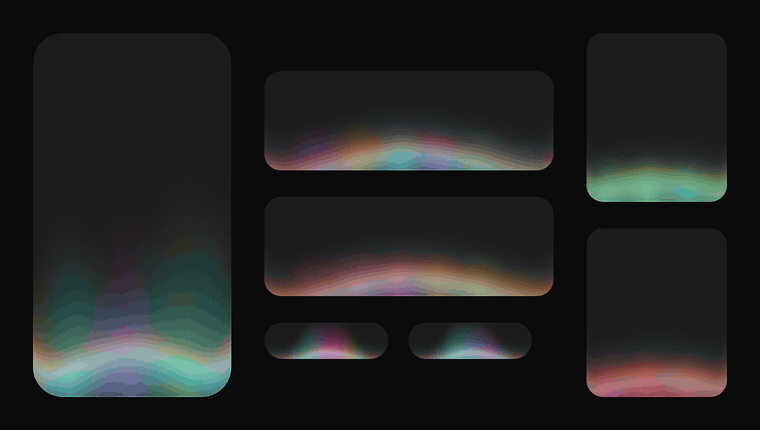
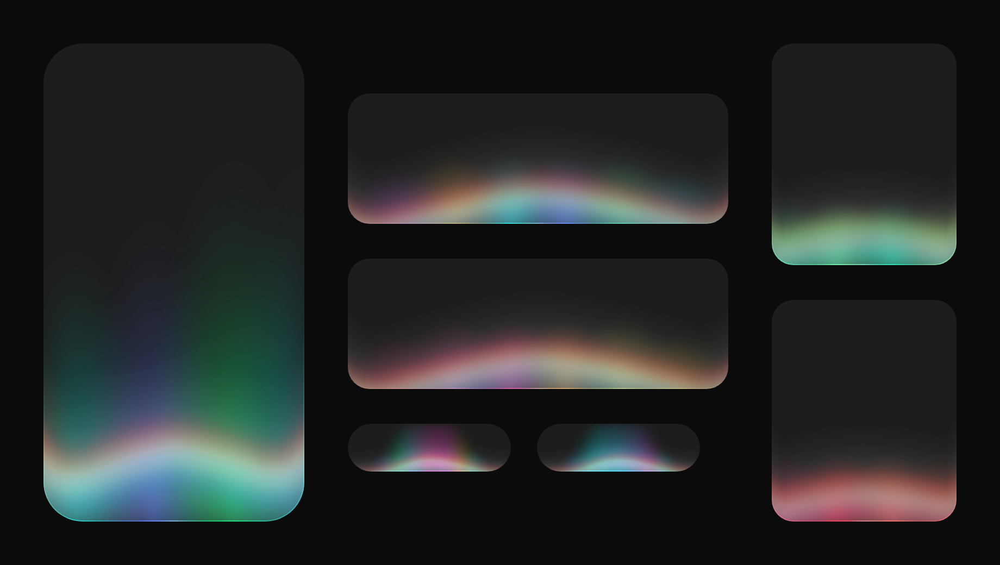
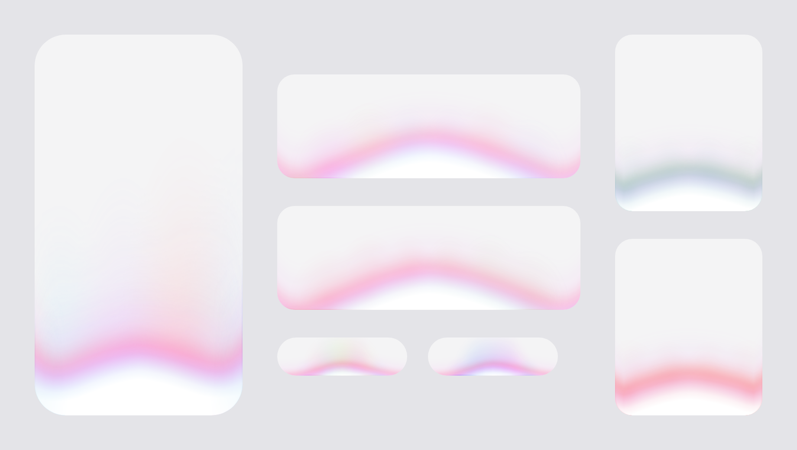
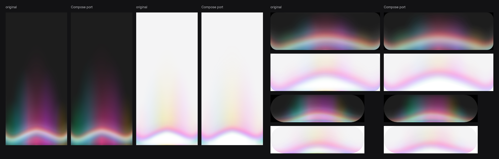

# voice-glow for Compose

A sound-reactive glow for Compose Multiplatform: a centred, colourful light along the bottom edge of a box that rises and blooms with a voice, with a bright band riding its ceiling. Give it a level and it does the rest.



This is a port of [voice-glow](https://libraries.dev/voice) by [Jakub Antalik](https://github.com/Jakubantalik/Libraries.dev), which exists for React and SwiftUI. The design, the motion and every number in it are his. The port draws the same picture with plain Compose gradients, so it needs no shader and no blur and looks the same on every target.

| | |
|---|---|
|  |  |

## Status

Version 0.1.0. It is not on Maven Central yet.

| Target | State |
|---|---|
| Android (API 23+) | Runs. Checked on an API 36 emulator: all three types, dark and light, 60 fps. |
| Desktop (JVM) | Runs. The tests draw every type here and compare it with the original. |
| iOS | Compiles. Not run on a device or simulator yet. It draws with Skia, like desktop. |
| Web (Wasm) | Compiles. Not run in a browser yet. |

## Install

Until the first release is on Maven Central, publish it to your local Maven repository:

```bash
./gradlew :voice-glow:publishToMavenLocal
```

```kotlin
// settings.gradle.kts
dependencyResolutionManagement { repositories { mavenLocal() } }

// build.gradle.kts
kotlin {
    sourceSets {
        commonMain.dependencies {
            implementation("io.github.dwite:voice-glow:0.1.0")
        }
    }
}
```

## Quick start

```kotlin
// level: 0–1, from a microphone meter, a playing voice, a speech API's volume event.
var level by remember { mutableFloatStateOf(0f) }

VoiceGlowBox(level = { level }, cornerRadius = 20.dp) {
    ChatInput()
}
```

`VoiceGlowBox` puts the glow over its content, cut to `cornerRadius`, as the original component does. `level` is a function, and the glow reads it every frame: a level that changes sixty times a second does not recompose anything.

For the bottom of a screen, draw the glow by itself, behind the content:

```kotlin
Box(Modifier.fillMaxSize()) {
    VoiceGlow(level = { level }, modifier = Modifier.fillMaxSize(), type = VoiceGlowType.Mobile)
    Screen()
}
```

A steady level works too. The glow follows it with an attack and a release, breathes while it is silent, and its colours travel and drift on their own.

## Types

The glow is authored for a chat input about 350 dp wide. `type` retunes it for other hosts.

| Type | Host |
|---|---|
| `VoiceGlowType.Standard` | A chat input or a card. |
| `VoiceGlowType.Pill` | A small recording pill, about 150 × 44 dp. |
| `VoiceGlowType.Mobile` | The bottom of a phone screen. |

## Everything you can set

The parameters of `VoiceGlow` and `VoiceGlowBox`:

| Parameter | |
|---|---|
| `level` | The voice, 0–1, as a function read every frame. |
| `type` | `Standard`, `Pill` or `Mobile`: the starting point of everything below. |
| `colors` | The lobe, band and mood colours. |
| `theme` | `Auto` (the system's dark theme setting), `Dark` or `Light`. On a light background the glow is pastel, with a white wash at its source. |
| `mood` | How the voice feels. |
| `strength` | How much of the glow shows, 0–1. It can be animated. |
| `scale` | Sizes the whole effect as one thing, on top of the type's own size. |
| `active` | Fades the glow in and out. |
| `paused` | Holds the glow exactly where it is. |
| `cornerRadius` | The host's corner radius. |
| `options` | Every finer adjustment: see below. |
| `haze` | Thins the light with height (`VoiceGlow` only). |
| `animated` | Off draws the one frame a steady level settles on, for previews and screenshot tests (`VoiceGlow` only). |

```kotlin
VoiceGlow(
    level = { level },
    type = VoiceGlowType.Mobile,
    colors = VoiceGlowColors.from(MaterialTheme.colorScheme.primary),
    strength = 0.7f,
    scale = 1.2f,
    options = VoiceGlowOptions(reach = 2f, attack = 0.15f, bandStrength = 1.2f),
)
```

### Colours

```kotlin
VoiceGlowColors.Sunset                                    // a palette: Colorful, Mono, Ocean, Sunset, Forest, Candy, Ice, Gold
VoiceGlowColors(Color(0xFFFF78BE))                        // one colour
VoiceGlowColors(listOf(pink, lavender, violet))           // your own, up to seven: the centre lobe first, then the pairs outward
VoiceGlowColors(dark = onDark, light = onLight)           // a set for each background
VoiceGlowColors.from(brandColor)                          // a palette grown around one colour
VoiceGlowColors.from(brandColor, hueSpread = 90f)         // the same, reaching further around the hue circle
```

`copy` changes the rest:

```kotlin
VoiceGlowColors.Ocean.copy(
    band = VoiceGlowBandColors(core = Color.White, above = Color(0xFFFFB347), below = Color(0xFF4FC3F7)),
    mood = VoiceMoodColors(happy = Color(0xFF46E678), angry = Color(0xFFFF7A5C), sad = Color(0xFF5A7BFF), calm = Color(0xFF3CD2C8)),
    drift = false,   // hold the colours exactly as given
)
```

New colours cross over instead of cutting, so the glow can change colour with whoever is speaking.

### Mood

A mood tints the glow with how the voice feels: happy green, calm teal, and red for anything negative.

```kotlin
VoiceGlow(level = { level }, mood = VoiceMood(valence = 0.8f, arousal = 0.7f))
```

`valence` runs from −1 (negative) to 1 (positive), `arousal` from 0 (calm) to 1 (excited), and `confidence` says how sure the source is. The glow leaves its own colours in proportion to the confidence, and keeps them below 15%. Where the mood comes from is yours to decide: a sentiment model on the transcript, an emotion model on the audio, a server. `VoiceMood.blend(tone, meaning)` merges two such reads.

This library does not detect emotion. In the original, that is part of VoiceGlow Pro.

### Options

`VoiceGlowOptions` has every finer adjustment, under the names the original's props have, so numbers tuned in the original's Studio carry over as they are. Every `null` keeps the value of the type and theme in use.

| | |
|---|---|
| `sensitivity`, `threshold`, `attack`, `release` | Gain on the level, the noise gate, and the seconds to rise and to settle. |
| `idle`, `breatheSeconds` | The breathing presence while silent. `idle = 0f` hides the glow between sounds. |
| `ripple` | The lobes ripple with slow wobbles of the level (the original's `bands`). |
| `reach`, `spread` | How far the voice lifts and widens the glow. |
| `flow` | dp per second the colours travel sideways at full level. |
| `bend` | How far the glow's ceiling humps up at the centre. |
| `brightness`, `saturation` | The light's colour. |
| `hueRange`, `hueSeconds` | The slow hue drift (the original's `hueDuration`). |
| `strokeOpacity`, `innerOpacity`, `bloomOpacity` | The three layers: the fine line on the edge, the soft light along the edges, the wide bloom. |
| `glowSize` | The softness of the bloom at the host's edges and of the white wash. |
| `bandStrength`, `bandWidth`, `bandPosition`, `bandCurve`, `bandSpread`, `bandSkew`, `bandOffset`, `bandAberration` | The band: its opacity, thickness, height, shape and the split of its fringes. |
| `bandTail`, `bandTailPosition`, `bandTailCurve`, `bandTailOverflow` | The rise of the band's ends toward the corners. `bandTail = 0f` ends the band inside the host. |
| `glowWidth`, `glowHeight`, `lobeSpacing`, `softness` | The seven lobes. |
| `rangeWidth`, `rangeHeight` | The ellipse the glow is kept to. |
| `strokeScale`, `innerScale`, `innerHeight`, `bloomScale`, `bloomHeight` | The size of the lobes in each layer. |
| `coreSize`, `coreLight`, `coreLightWidth`, `coreLightHeight` | The hot spot on the edge, and the white wash at the source. |
| `moodStrength`, `moodSmoothing`, `moodRelease` | How far and how fast a mood takes the colours. |

Where the names differ from the original's props:

| Original | Here |
|---|---|
| `colorVariant`, `colors`, `bandColors`, `staticColors` | `colors`: a palette, your own colours, `copy(band = …)`, `copy(drift = false)` |
| `borderRadius` | `cornerRadius` |
| `bands` | `options.ripple` |
| `hueDuration`, `breatheDuration` | `options.hueSeconds`, `options.breatheSeconds` |
| `strength` | `strength`, as a share of the type's own strength rather than in place of it |
| `scale` | `scale`, on top of the type's own size rather than in place of it |
| `stream`, `sensitivity` | No microphone here. `options.sensitivity` is a gain on `level`. |

### Haze

`haze` is not in the original. It thins the light with height, for a screen with buttons and a line of text near its foot: the light stays bright behind the buttons, and the text above them stays easy to read.

```kotlin
VoiceGlow(level = { level }, type = VoiceGlowType.Mobile, haze = VoiceGlowHaze(from = 60.dp, to = 90.dp, keep = 0.4f))
```

## How close it is to the original



`tools/parity` renders the original in Chrome and the port with Skia, at the same size and the same level, and compares them point by point. Over 32 cases (three types, two themes, four levels, eight palettes) the mean difference in brightness is 1.2 of 255. The largest mean for one case is 4.8, for the dark pill at full level. The two are never identical: the original breathes and ripples while its picture is taken, and it blurs where the port shades.

```bash
cd tools/parity
npm install
node shoot.mjs                                   # the original, into out/original
VOICE_GLOW_SNAPSHOTS=$PWD/out/port ../../gradlew -p ../.. :voice-glow:desktopTest
python3 compare.py                               # numbers, and out/compare/*.png
```

Not ported:

- The microphone meter. The glow takes a level; reading a microphone is left to the app.
- The warp of the host's content under the band, which only the web version has.
- The `dots` and `lines` looks.
- The motion that gathers the lobes into one beam. In the original it drives the processing state of VoiceGlow Pro.
- The faint inset shadow of the inner light.
- The callbacks (`onLevel`, `onActivate`, `onDeactivate`).

## Sample

```bash
./gradlew :sample:run                      # desktop
./gradlew :sample-android:installDebug     # Android
```

## Releasing

The Maven coordinates are `GROUP` and `VERSION_NAME` in `gradle.properties` and `POM_ARTIFACT_ID` in `voice-glow/gradle.properties`. With a Maven Central account for the `io.github.dwite` namespace and a signing key in `~/.gradle/gradle.properties` (`mavenCentralUsername`, `mavenCentralPassword`, `signingInMemoryKey`, `signingInMemoryKeyPassword`):

```bash
./gradlew :voice-glow:publishAndReleaseToMavenCentral
```

## Licence

MIT, as the original. See [LICENSE](LICENSE).
